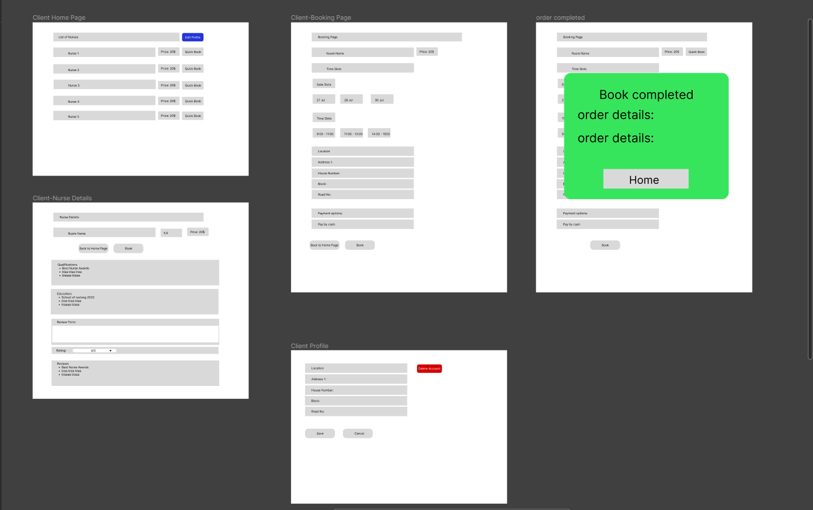
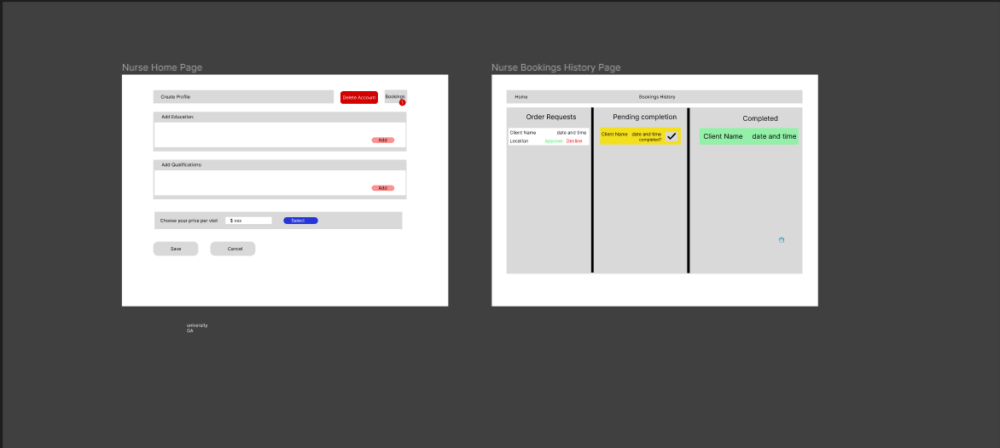
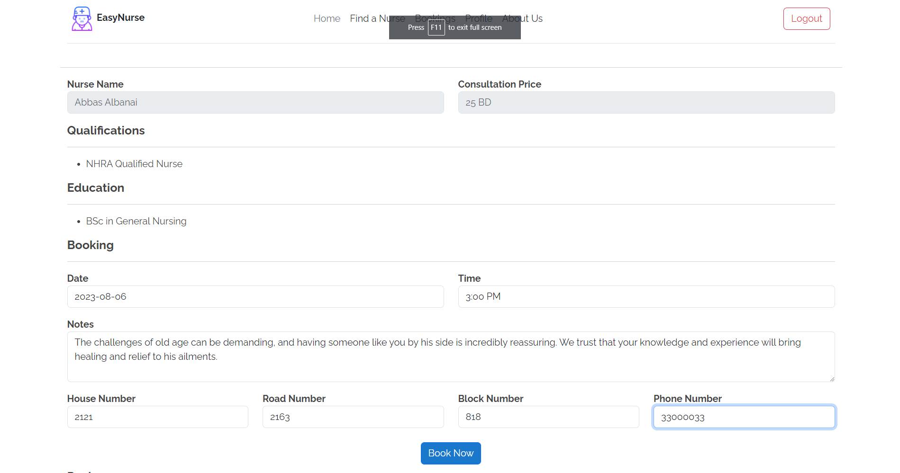
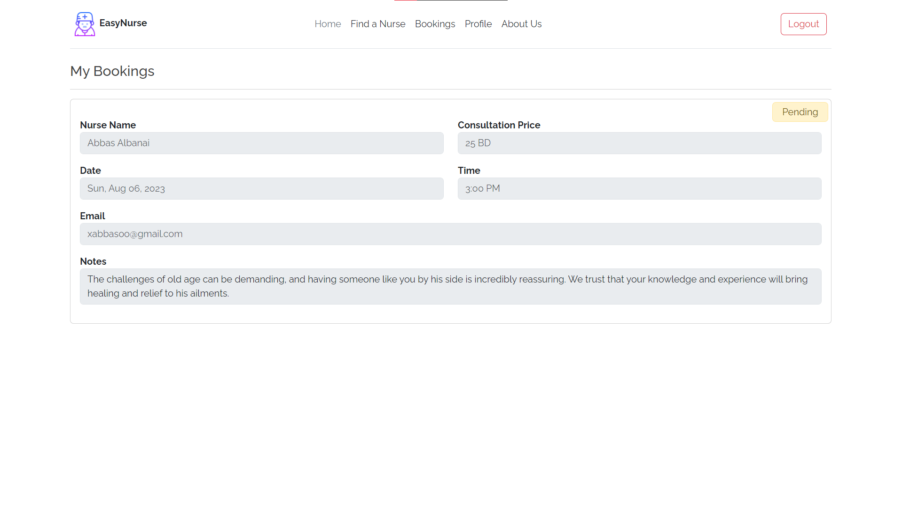
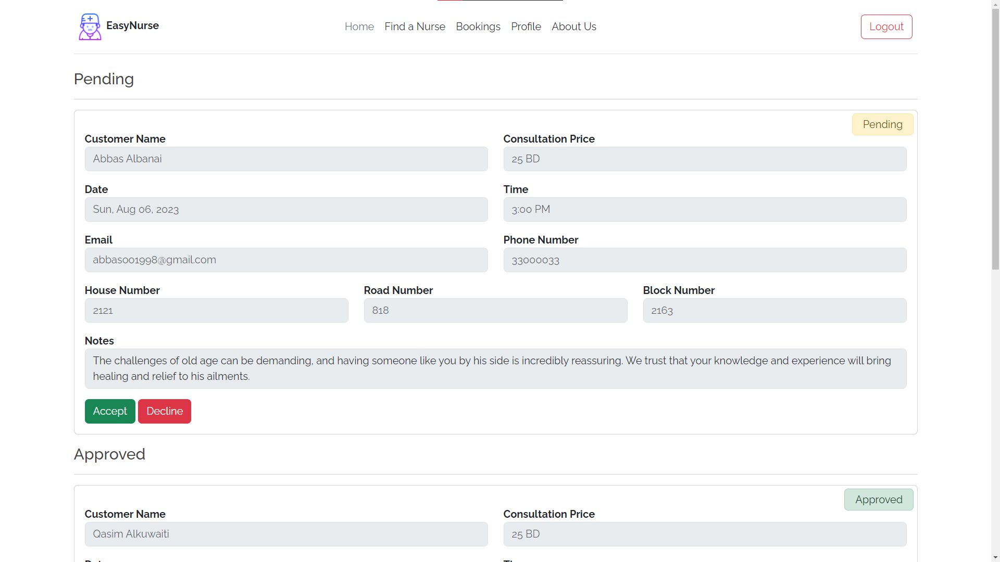

# EasyNurse

This project make it effortless for patients to find and book appointments with qualified nurses based on their availability and expertise. Nurses can also update their profiles, showcasing their qualifications, and education to attract patients.

## Instructional Team

|Role        | Name            |
|:--         | :--             |
|Lead Instructor | Tor Johnson |
|Lead Instructor | Avan Sardar |
|Instructor Associate | Ahlam Almutawa |
|Instructor Associate | Mohamed Faris |

## Wireframes (figma)

## Technologies Used

- HTML, CSS & Bootstrap 5
- Node.js
- Express.js
- MongoDB

## Features

- Users able to register and login to the system.
- Users able to view nurses with their education and expertise.
- Users able to book appointments with nurses based on their availability.
- Users (Nurse or Customer) able to add and delete reviews to nurses.
- Allows users to update their personal information and delete their account.
- Allows nurses to approve or decline bookings.

## Functions

| Function | Description|
| ----------------------- | ---------------------------------------------------------------------------------------------------------------------------------------------------------------------------------------------------------------------------------------------------------------------------------------------------------------------------------- |
| `Update User Data` | This function allows either a nurse or a customer to update their personal information in the database. The data that can be updated may include their name, contact details, address.|
| `Delete User` | a user (either a nurse or a customer) can delete their account from the system. |
| `Update User Role` | Allow user to change his role, granting them access to the relevant features and functionalities based on their new role. |
| `Add review` | Both customers and nurses can use this function to add reviews to nurses available. |
| `Delete review` | enables users (customers or nurses) to delete their own reviews that they previously wrote. When called, the function checks the user's credentials and ensures that they have the authority to delete the specific review associated with their account. Once confirmed, the review is removed from the database.|
| `Nurse Approve or Decline Bookings`| Only nurses have access to this function, which allows them to manage their bookings. When called, it presents the nurse with pending booking requests, and they can either approve or decline each booking. The status of the bookings is updated accordingly in the database, indicating whether they have been approved or declined by the nurse. |

## Future Enhancements

- Add animations to enhance the user experience.
- Allows users to search for nurses based on their location or their expertise.
- Allows users to filter nurses based on their availability and ratings.

## Screenshots

